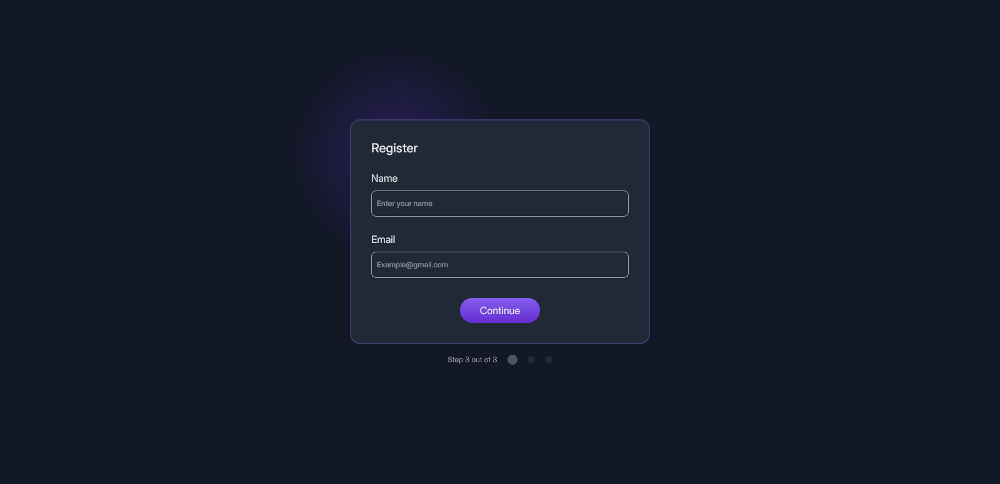

<!-- Please update value in the {}  -->

<h1 align="center">{Multi Step Register Form} | devChallenges</h1>

   Solution for a challenge <a href="https://devchallenges.io/challenge/multi-step-register-form" target="_blank">Multi-step Register Form</a> from <a href="http://devchallenges.io" target="_blank">devChallenges.io</a>.

  <h3>
    <a href="{https://your-demo-link.your-domain}">
      Demo
    </a>
     | 
    <a href="{https://your-url-to-the-solution}">
      Solution
    </a>
     | 
    <a href="https://devchallenges.io/challenge/multi-step-register-form">
      Challenge
    </a>
  </h3>

<!-- OVERVIEW -->

## Overview

### What I learned

- I practiced DOM manipulation how to connect different events. Getting relevant click event result was an acheivment.

### Built with

<!-- This section should list any major frameworks that you built your project using. Here are a few examples.-->

- Semantic HTML5 markup
- CSS custom properties
- Flexbox
- Vanilla Js

## Features

- Toggle between steps 
- Real time input and data change in final step from previous steps
- Fully Responsive

## Continue Development

- Adding top left border as per in the design
- Form validation for all the three steps
- Giving ech step a smooth animation
- Success message to be added

